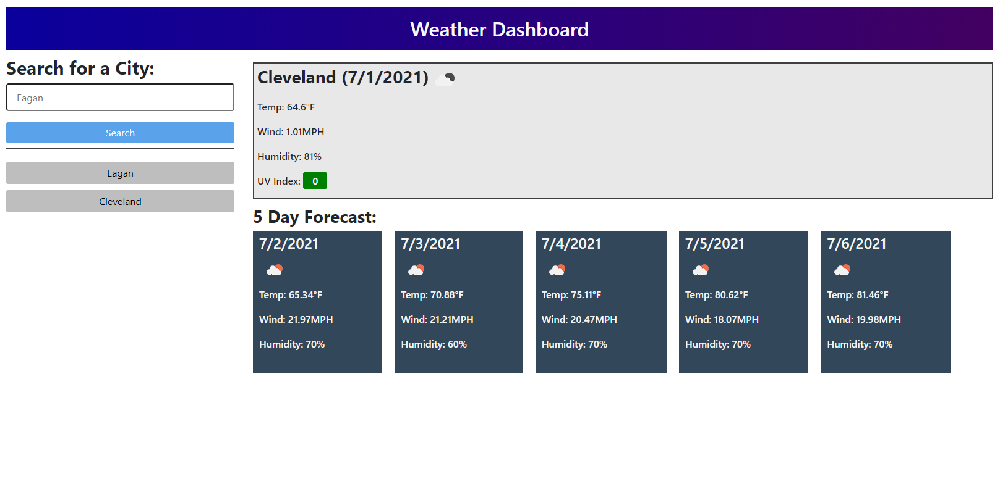

## Challenge Six Server Side API

### Description
This week's challenge involved navigating Open Weather's API to return data relevant to the city the user inputed. This involved nesting several fetch requests, using data from the first in the second, and appending the data to generated DOM elements. Doing this would also store the data in the local storage and assign it to a button that was also dynamically generated in the DOM.

### Screenshot 

### Link
https://logandufek.github.io/WeatherApp-ServerSideAPI/
